Here's an algorithm description and flowchart for the continued fractions method to isolate positive root intervals of a polynomial:

Algorithm Description:
1. Validate the input polynomial and check if it has positive roots. If not, return an empty list.
2. Initialize:
   - Make the polynomial squarefree (P(x) = SquareFree(P(x))).
   - Set the initial Möbius transformation M(x) = x = (1x+0)/(0x+1).
   - Count the initial sign variations (varCount = Var(P)).
   - Create a queue of tasks, where each task is a tuple (P(x), M(x), varCount).
   - Create an empty list to store the isolated root intervals.
3. While the task queue is not empty:
   - Dequeue a task (currentPolynomial, currentMobius, variationCount0ToInf).
   - Handle edge cases:
     - Check for empty coefficients and handle accordingly.
     - If the polynomial is a constant function, handle the zero function case.
     - Check for NaN in coefficients and validate before proceeding.
   - Compute a positive lower bound (lowerBound) for the current polynomial.
   - Adjust the current polynomial and Möbius transformation based on the lower bound.
   - Check and handle the case of a root at zero.
   - If variationCount0ToInf is 0, continue to the next task.
   - If variationCount0ToInf is 1, add the Möbius interval to the isolated root intervals and continue.
   - If variationCount0ToInf > 1, split the interval into ]0,1[, [1,1], and ]1,+inf[:
     - For ]1,+inf[:
       - Apply a Taylor shift by 1 to the current polynomial and Möbius transformation.
       - Check and handle the case of a root at zero.
       - Count the sign variations (variationCount1ToInf) for the transformed polynomial.
       - If variationCount1ToInf is 1, add the Möbius interval to the isolated root intervals.
       - If variationCount1ToInf > 1, enqueue a new task with the transformed polynomial and Möbius transformation.
     - For ]0,1[:
       - Compute the sign variations (variationCount0To1) for the interval ]0,1[.
       - If variationCount0To1 is 0, continue to the next task.
       - Transform the current polynomial and Möbius transformation for the lower interval ]0,1[.
       - If variationCount0To1 is 1, add the Möbius interval to the isolated root intervals.
       - If the constant term of the transformed polynomial is close to zero, shift the coefficients by 1.
       - Enqueue a new task with the transformed polynomial and Möbius transformation.
4. Return the list of isolated root intervals.

Flowchart:

```mermaid
graph TD
A[Start] --> B{Validate input and check for positive roots}
B -- No positive roots --> C[Return empty list]
B -- Has positive roots --> D[Initialize: Make polynomial squarefree, set initial Möbius transformation, count sign variations, create task queue and isolated root intervals list]
D --> E{Task queue empty?}
E -- Yes --> F[Return isolated root intervals]
E -- No --> G[Dequeue task: currentPolynomial, currentMobius, variationCount0ToInf]
G --> H[Handle edge cases: empty coefficients, zero function, NaN coefficients]
H --> I[Compute positive lower bound and adjust polynomial and Möbius transformation]
I --> J[Check and handle root at zero]
J --> K{variationCount0ToInf = 0?}
K -- Yes --> E
K -- No --> L{variationCount0ToInf = 1?}
L -- Yes --> M[Add Möbius interval to isolated root intervals]
M --> E
L -- No --> N[Split interval into &#93;0,1&#91;, &#91;1,1&#93;, and &#93;1,+inf&#91;]
N --> O[Handle &#93;1,+inf&#91;: Taylor shift, check root at zero, count sign variations]
O --> P{variationCount1ToInf = 1?}
P -- Yes --> Q[Add Möbius interval to isolated root intervals]
Q --> R[Handle &#93;0,1&#91;: Compute variationCount0To1]
P -- No --> S{variationCount1ToInf > 1?}
S -- Yes --> T[Enqueue new task with transformed polynomial and Möbius transformation for &#93;1,+inf&#91;]
T --> R
S -- No --> R
R --> U{variationCount0To1 = 0?}
U -- Yes --> E
U -- No --> V{variationCount0To1 = 1?}
V -- Yes --> W[Add Möbius interval to isolated root intervals]
W --> E
V -- No --> X[Transform polynomial and Möbius transformation for &#93;0,1&#91;]
X --> Y[Shift coefficients if constant term is close to zero]
Y --> Z[Enqueue new task with transformed polynomial and Möbius transformation for &#93;0,1&#91;]
Z --> E
```

This algorithm recursively subdivides the positive real line into intervals using the continued fractions method, isolating intervals that contain exactly one real root of the polynomial. The Möbius transformations are used to map the intervals and keep track of the transformations applied to the polynomial.